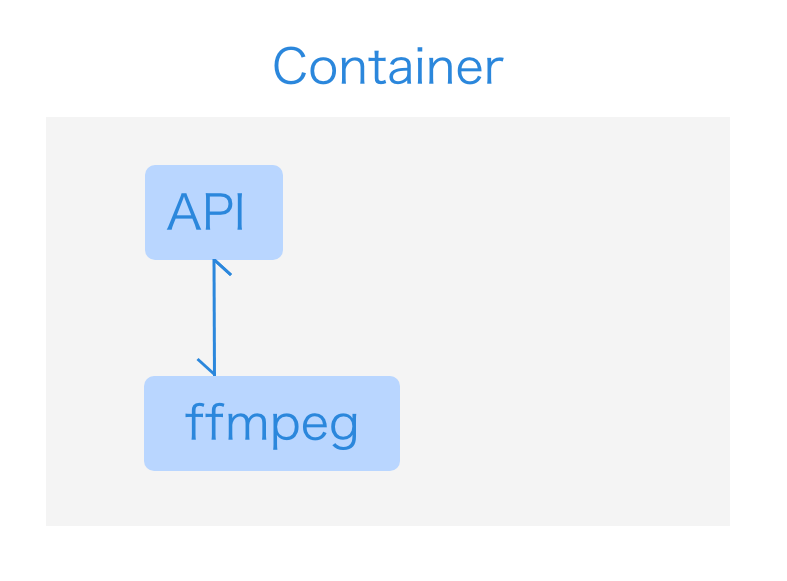
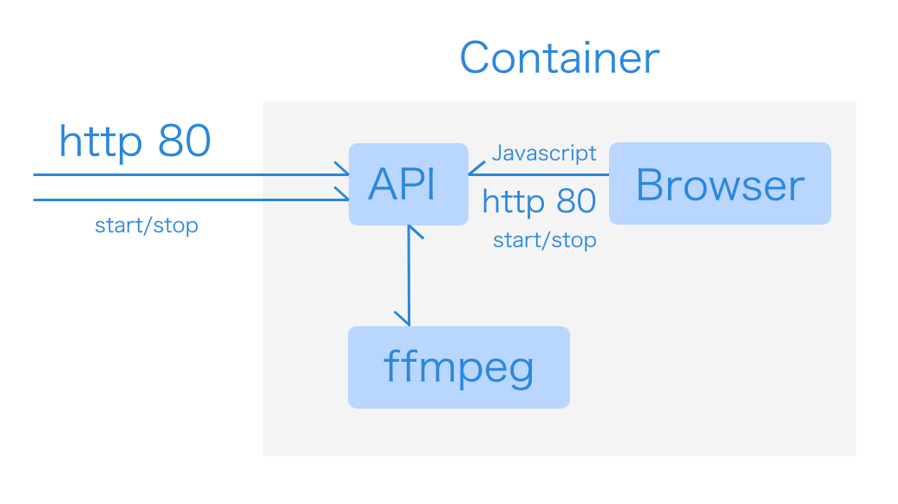

[简体中文](README.cn.md)

# Browser Recording Tool and Self-Playing Web Page Specification

- Specification BROWSER-REC / BRREC for short
- Specification BROWSER-REC-SELF-PLAYING-WEB / BRSPW for short

## What is a browser recording tool

A screen recorder can record a computer screen, while a browser recorder can record a browser. The point of recording the browser is to organize the content with pure Web technology.

## What is a self-playing web page
There is no point in recording a static web page, but we can use JavaScript to make it possible to automatically and chronologically display different content when it is accessed. This type of web page is called a "self-playing web page".

## Interaction between "Browser Recording Tool" and "Self-Playing Web Page

In order to synchronize the content of a web page with the recording operation, we need to have interaction between the web page and the recording tool. At a minimum, a one-way notification mechanism is needed.

A common implementation is to start an http service in the "browser recording tool" that listens for request response control.

This specification describes a simple interaction interface to facilitate compliance with the specification so that web pages can be made compatible with more recording tools.

## Specification content

### Protocol
Provides an http protocol to accept requests

### Interface

#### /start 

- Interface description: start recording
- Parameters: No parameters
- Methods: GET and POST
- Success return: {"code":"0","message": "done", "task_id":""} task_id is optional
- Error return: {"code": "error number", "error": "error message"}
- Note: To facilitate the call, this interface needs to support CORS call

#### /stop

- Interface description: stop recording
- Parameters: task_id (optional)
- Methods: GET and POST
- Success return: {"code":"0","message": "done"}
- Error return: {"code": "error number", "error": "error message"}
- Note: To facilitate the call, this interface needs to support CORS call

#### /detail - optional

- Interface description: Check the status of the recorded task
- Parameters: task_id (optional)
- Methods: GET and POST
- Success return: {"code":"0","message":{"recorded task status object"}}
- Error return: {"code": "error number", "error": "error message"}
- Note: To facilitate the call, this interface needs to support CORS call

### Other notes

If the "Browser Recording Tool" includes a browser, then in addition to accessing the http interface from outside, the recorded web page itself can also access this interface. This allows the web page to actively control the recording operation.

For example, the /start port can be called via JavaScript when the content is loaded, and the /stop port can be called via Javascript to end the recording when the content is finished.

Self-playing web pages that control recording operations through the above interface are considered to comply with the BRSPW specification.

